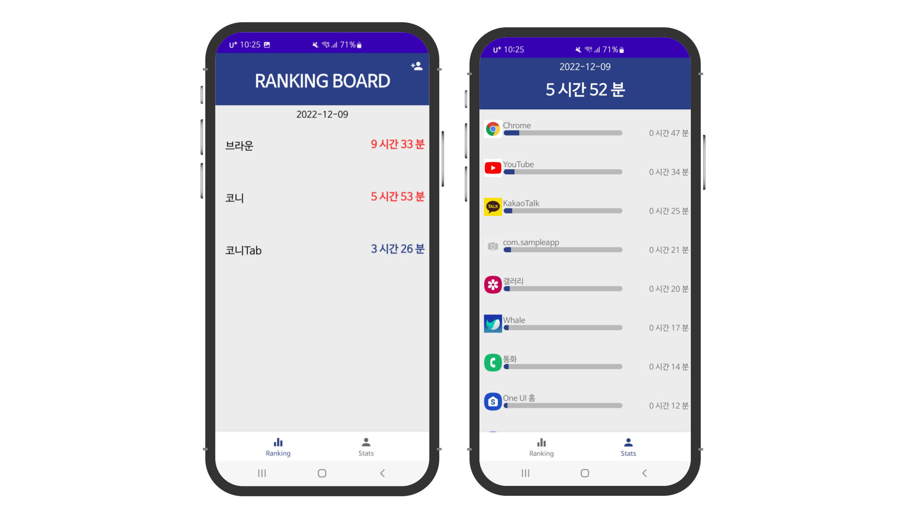

# :mobile_phone_off:ScreenDetox
ScreenDetox는 친구들과 함께하는 스마트폰 중독 방지 애플리케이션입니다. 
Screen Detox를 통해 친구에게 관찰되고 있다는 긴장감을 통해 스스로 스마트폰 사용을 절제하는 넛지 효과를 기대할 수 있습니다.

## About

* 2022년 2학기 경희대학교 소프트웨어융합캡스톤디자인
* 개발 기간: 2022.09.30 ~ 2022.12.20

## Features

* 통계 탭에서 나의 스마트폰 사용 내역을 확인할 수 있습니다.

* 랭킹 탭에서 친구들의 스마트폰 사용 시간을 확인할 수 있습니다. 친구의 스마트폰 사용 시간이 목표 시간을 넘으면 빨간색으로 표시됩니다. 친구를 누르면 친구가 가장 많이 사용하는 어플리케이션을 알 수 있습니다.

